# Project 2: Design Journey

**For each milestone, complete only the sections that are labeled with that milestone.** Refine all sections before the final submission. If you later need to update your plan, **do not delete the original plan, leave it place and append your new plan below the original.** Explain why you are changing your plan. Remember you are graded on your design process. Updating the plan documents your process!

**Replace ALL _TODOs_ with your work.** (There should be no TODOs in the final submission.)

Be clear and concise in your writing. Bullets points are encouraged.

**Everything, including images, must be visible in Markdown Preview.** If it's not visible in Markdown Preview, then we won't grade it. We won't give you partial credit either. **Your design journey should be easy to read for the grader; in Markdown Preview the question _and_ answer should have a blank line between them.**


## Design / Plan (Milestone 1)

**Make the case for your decisions using concepts from class, as well as other design principles, theories, examples, and cases from outside of class (includes the design prerequisite for this course).**

You can use bullet points and lists, or full paragraphs, or a combo, whichever is appropriate. The writing should be solid draft quality.

### Audiences (Milestone 1)

> Who are your site's audiences?
> Briefly explain who the intended audiences are for your project website.
> **DO NOT INVENT RANDOM AUDIENCES HERE!** Use the audiences from the requirements.

_Consumer_: My site's consumers are parents with developing children. They want to select plants that help their children to engage in nature in a whole year.

_Site Administrator_: My site's administrators are members of the playful plants project. They are responsible for managing the database of the playful plants on my site.


### _Consumer_ Audience Goals (Milestone 1)

> Document your audience's goals.
> List each goal below. There is no specific number of goals required for this, but you need enough to do the job.
> **DO NOT INVENT RANDOM GOALS HERE OR STEREOTYPE HERE!** Your goals are things that your users want accomplish when using the site (e.g. print a list of plants). These are informed by the Playful Plants objectives. Review the assignment's requirements for details.

_Consumer_ Goal 1: Browse the appearance of plants in the catalog

- **Design Ideas and Choices** _How will you meet those goals in your design?_
  - Create a catalog page that presents basic information about each plant
  - Display the image of each plant on the catalog page
- **Rationale & Additional Notes** _Justify your decisions; additional notes._
  - Images are important in terms of providing friendly user experience.
  - Images convey more information that texts are hard to tell.
  - Still waiting for image resources
  - For plants that don't have an image, use a cartoon image as a placeholder.

_Consumer_ Goal 2: Select suitable types of plants to use in their gardens

- **Design Ideas and Choices** _How will you meet those goals in your design?_
  - Use a sidebar for consumers to filter the plants
  - Provide options for filtering by general classification
  - Plants will also be tagged based on the general classification
  - Provide details about each plant's growing needs and characteristics in the plant detail page

- **Rationale & Additional Notes** _Justify your decisions; additional notes._
  - Possible options:
    - Shrub
    - Grass
    - Vine
    - Tree
    - Flower
    - Groundcovers
    - Other (Mosses, Ferns, Vegetables, etc.)
  - Possible growing needs and characteristics:
    - Perennial
    - Annual
    - Full Sun
    - Partial Shade
    - Full Shade
    - Hardiness Zone Range
  - The "Other" should be provided with detailed examples for consumers who prefer comprehensive information.

_Consumer_ Goal 3: Explore the play opportunities of every plant

- **Design Ideas and Choices** _How will you meet those goals in your design?_
  - Create a detailed page for each plant
  - Include the play opportunities in the detailed page

- **Rationale & Additional Notes** _Justify your decisions; additional notes._
  - Possible options:
    - Creates nooks or secret spaces
    - Provides loose parts/play props
    - Supports climbing and swinging
    - Used to create mazes/labyrinths/spirals
    - Includes evocative or unique elements

_Consumer_ Goal 4: Organize a list of helpful plants after browsing the catalog

- **Design Ideas and Choices** _How will you meet those goals in your design?_
  - Allow consumers to sort the plant by their names

- **Rationale & Additional Notes** _Justify your decisions; additional notes._
  - Possible options:
    - Name A-Z
    - Name Z-A


### _Consumer_ Persona (Milestone 1)

> Use the goals you identified above to develop a persona of your site's audience.
> Create your persona using GenderMag's customizable personas.
> Take a screenshot and include it here. Persona must be visible in Markdown Preview; do not use PDF format!

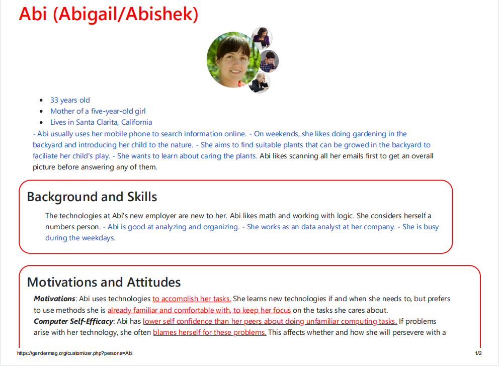
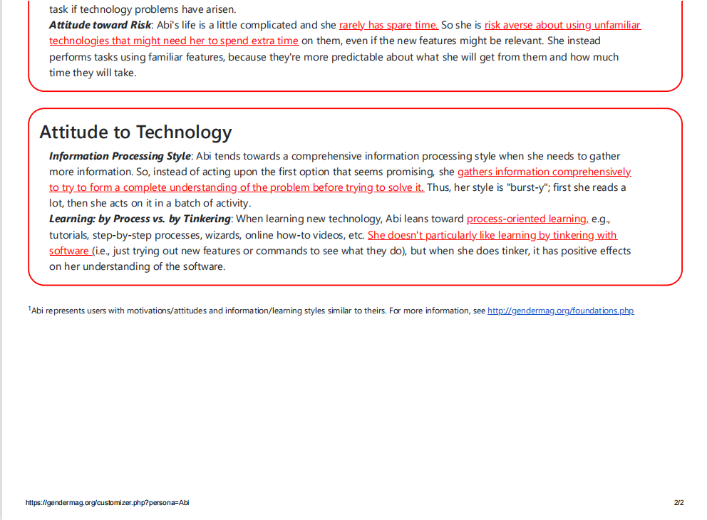


### _Administrator_ Audience Goals (Milestone 1)

> Document your audience's goals.
> List each goal below. There is no specific number of goals required for this, but you need enough to do the job.
> **DO NOT INVENT RANDOM GOALS HERE OR STEREOTYPE HERE!** Your goals are things that your users want accomplish when using the site (e.g. print a list of plants). These are informed by the Playful Plants objectives. Review the assignment's requirements for details.

_Administrator_ Goal 1: Classify the plants according to their play types

- **Design Ideas and Choices** _How will you meet those goals in your design?_
  - Display play types information to admins
  - Allow admins to edit play types of the plants
  - Allow admins to filter the plants by play types

- **Rationale & Additional Notes** _Justify your decisions; additional notes._
  - I can use the filter for plant types in project.
  - The tags for each plant will be play types.
  - Admins can edit the play types on the plant detail page.

_Administrator_ Goal 2: Support the creation of natural play spaces

- **Design Ideas and Choices** _How will you meet those goals in your design?_
  - Display play opportunities of each plant to admins
  - Allow admins to edit the play opportunities of each plant

- **Rationale & Additional Notes** _Justify your decisions; additional notes._
  - The information about play opportunities will be on the plant detail page.
  - Admins can edit the play opportunities on the plant detail page.

_Administrator_ Goal 3: Manage the database of playful plants

- **Design Ideas and Choices** _How will you meet those goals in your design?_
  - Allow administrators to add, edit, and delete plants in the catalog
  - Display the plant ID and plant name for administrators

- **Rationale & Additional Notes** _Justify your decisions; additional notes._
  - There will be an add button on the catalog page that directs the admins to the add form.
  - There will be an edit button on the plant detail page that directs the admins to the edit form.
  - There will be a delete button in each plant grid on the catalog page.

  _Administrator_ Goal 4: Develop a web resource for sharing the plant list

- **Design Ideas and Choices** _How will you meet those goals in your design?_
  - Allow administrators to filter and sort the plants
  - Design a printable plant list

- **Rationale & Additional Notes** _Justify your decisions; additional notes._
  - The plant list will include plant id, plant names, and play types.
  - Filter options will be play types.
  - Admins can sort the plant in the same way as consumers.


### _Administrator_ Persona (Milestone 1)

> Use the goals you identified above to develop a persona of your site's audience.
> Create your persona using GenderMag's customizable personas.
> Take a screenshot and include it here. Persona must be visible in Markdown Preview; do not use PDF format!

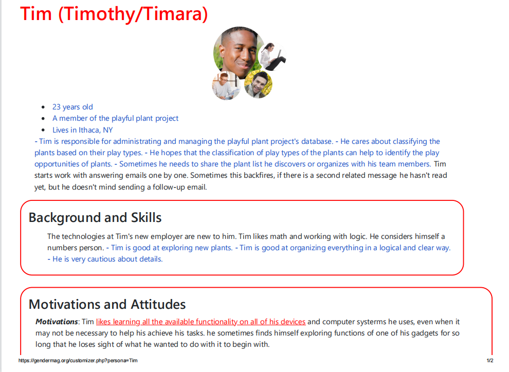
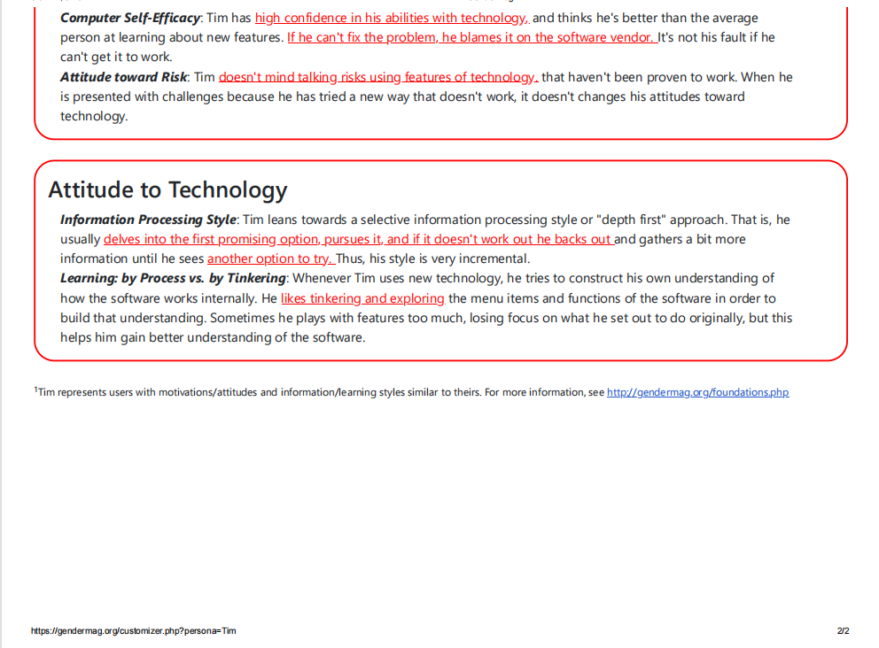


### Site Design (Milestone 1)

> Document your _entire_ design process. **We want to see iteration!**
> **Show us the evolution of your design from your first idea (sketch) to the final design you plan to implement (sketch).**
> **Show us how you decided what data to display to each audience.**
> **Plan your URLs for the site.**
> **Provide a brief explanation _underneath_ each design artifact (2-3 sentences).** Explain what the artifact is, how it meets the goals of your personas (**refer to your personas by name**).
>
> **Important!** Plan _all_ site requirements. Don't forget login and logout.

_Initial Designs / Design Iterations:_

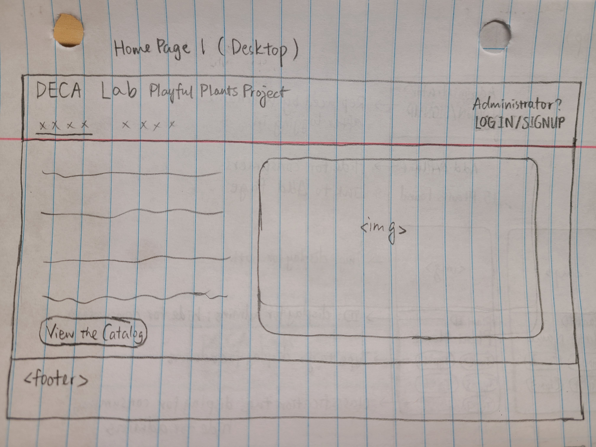

The home page provides basic introduction and a navigation to the catalog. Tim needs to log in or sign up at the top right corner.

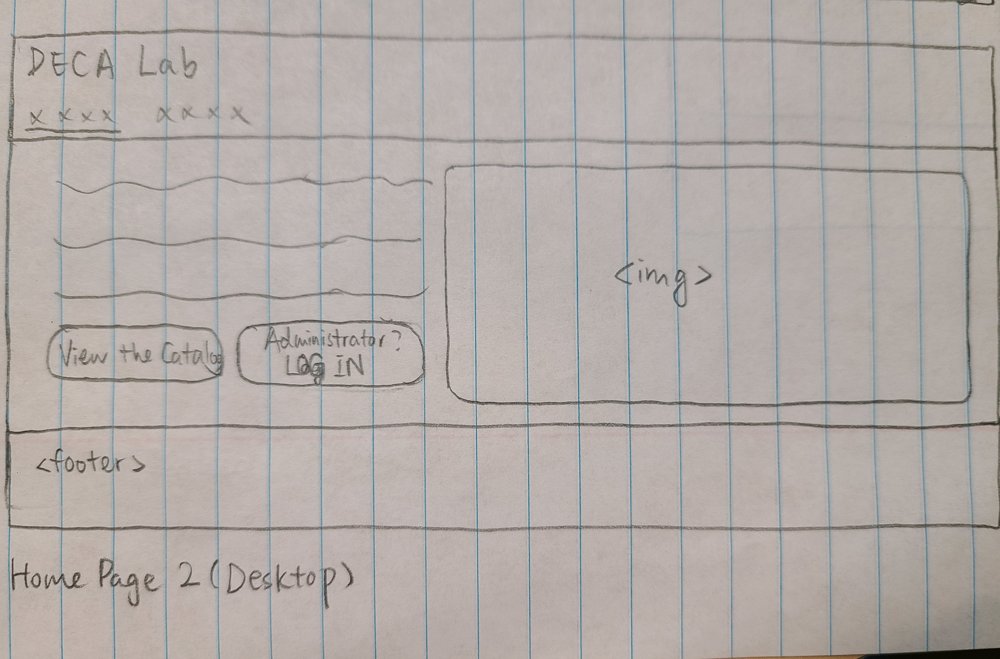

Instead of signing up or logging in on the top right corner, I moved the button to the right side of the view catalog button. However, the previous version is better because it is more common and uniform throughout the whole website. The two buttons may make Abi feel confused.

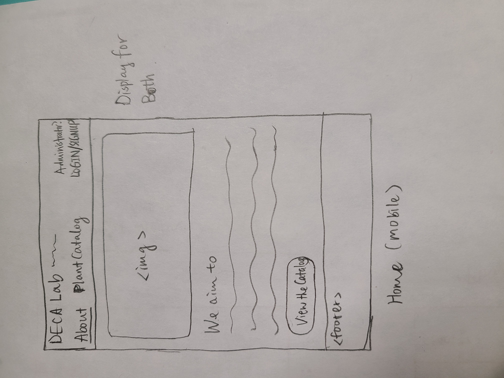

The images, texts, and button are aligned in a column. Abi can also use the navigation bar to access the catalog. Tim can log in/sign up at the top right corner.

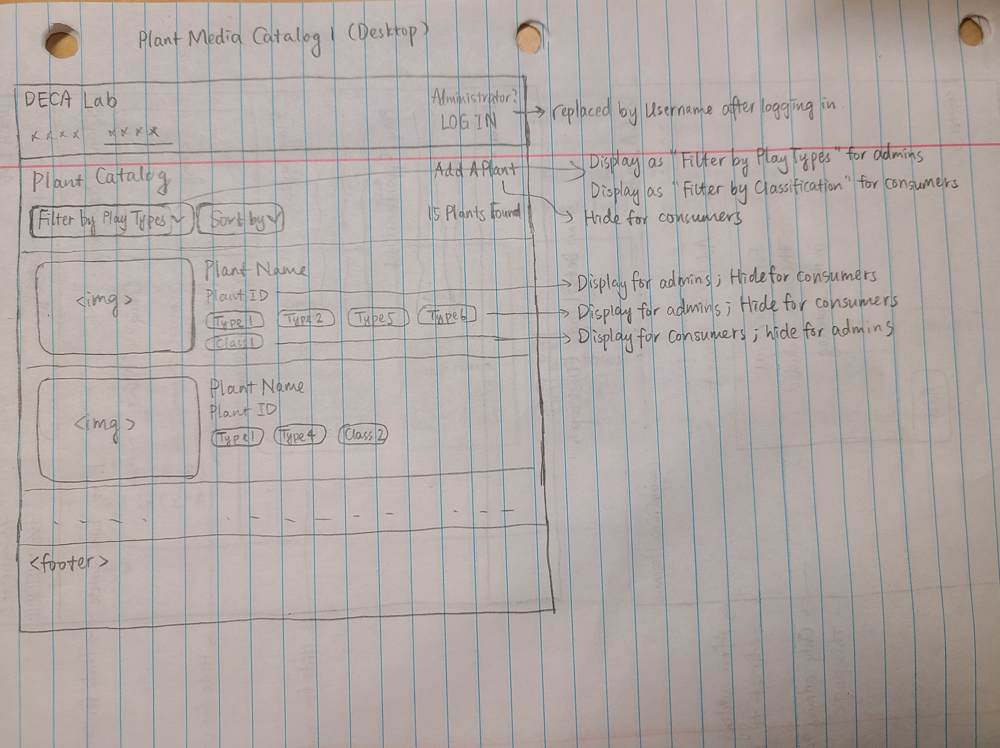

This catalog employs a list of tiles to display information. However, the density of information in this layout may be too low. Also, Abi would like to see a more comprehensive information and Tim would like to browse the available features on this page. It's better to display the options of filtering and sorting. On top of the catalog, there is a link for Tim to add a plant.

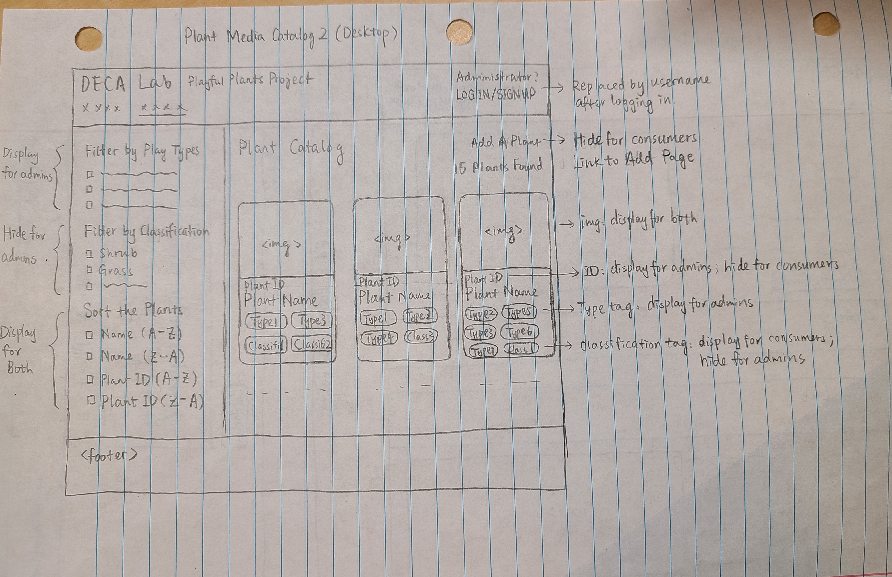

Compared with the previous one, this one will not have too much white space, and also satisfies Abi and Tim.

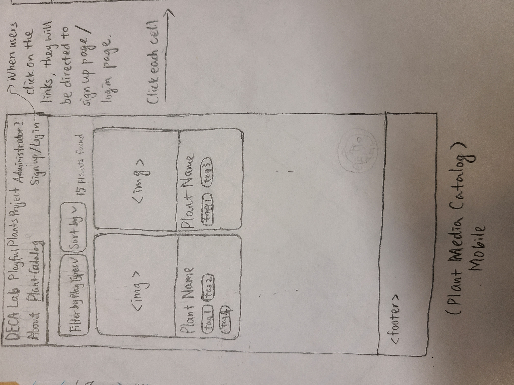

This one employs a grid layout. The filter and sorting options are hidden in order to leave more space for the catalog.

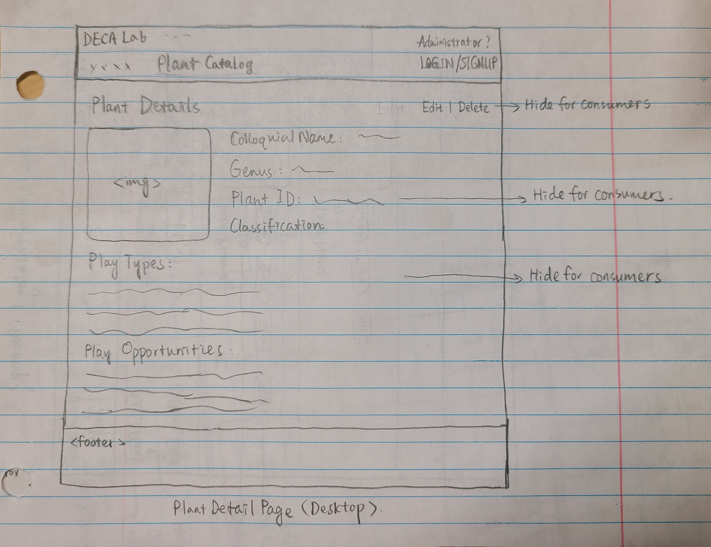

This page is displayed after either user clicks a plant. The image is on the left and texts are around the image. On the top right corner, there are options for Tim to edit the current plant or delete it.

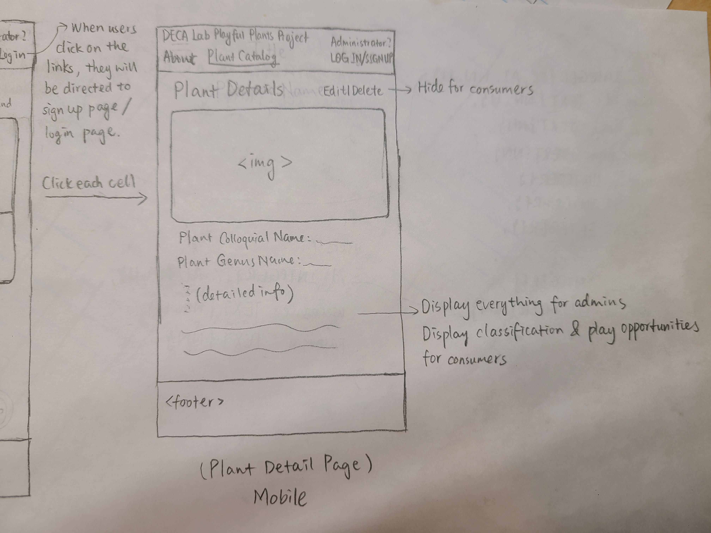

Instead of display the information side by side, this mobile layout is linear. The edit and delete options are still on the top right corner.

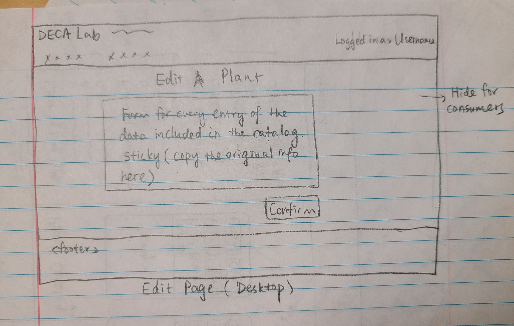

This page has a similar layout to that of login page and add page. The title is to inform Tim about the function of this page. The form is centered. The existing information will be sticky in this form.

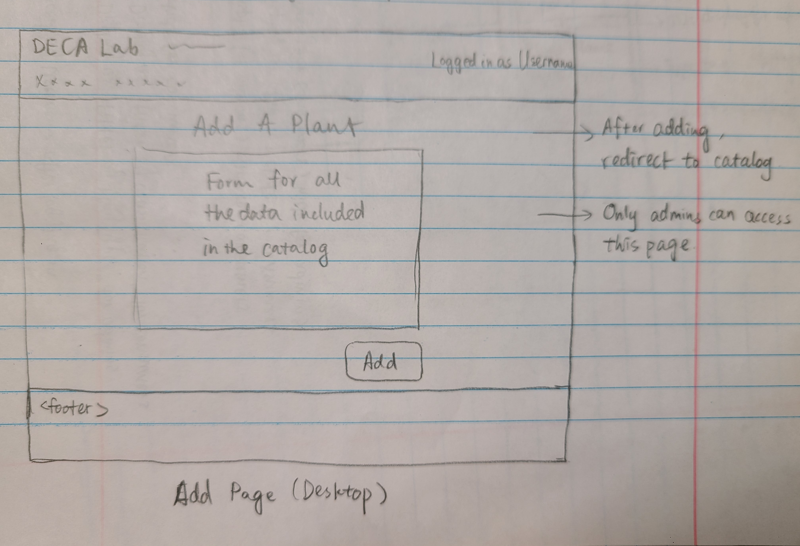

This page has a similar layout to that of edit page and login page. The only difference from add page is the title, button text, and that there won't be initial values in the input boxes.

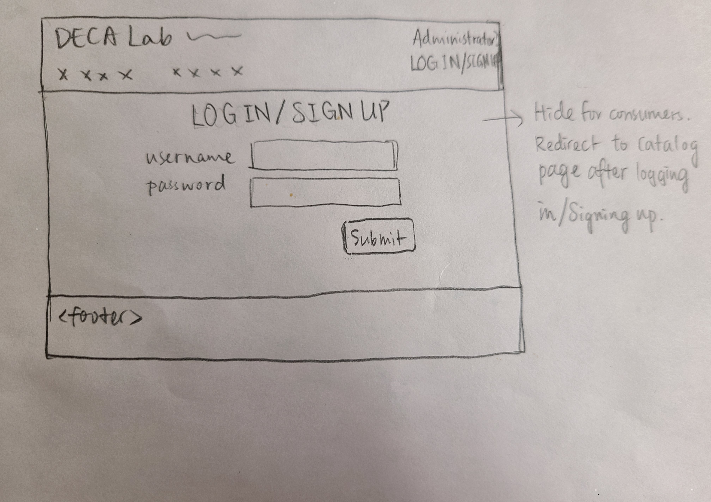

This page has a similar layout to that of edit and add page. The title suggests that users can either log in or sign up at this page.


_Final Design:_


_Data to display (also annotated in the sketches):_

On the catalog page, plant ID, plant colloquail name, play type tags will be displayed to admins. Plant colloquail name, classfication tags will be displayed to consumers.

On the plant detail page, plant ID, plant colloquail name, plant genus name, plant play types, plant classification, and plant play opportunities will be displayed to admins. Plant ID and plant play types will be hidden from consumers.

_URL Design:_

| Route | PHP File                                 |
| ---------------------- | ----------------------- |
| /                      | pages/home.php          |
| /plant-catalog         | pages/catalog.php       |
| /plant-detail          | pages/detail.php        |
| /edit-plants           | pages/edit.php          |
| /add-plants            | pages/add.php           |
| /login                 | pages/login.php         |

### Design Pattern Explanation/Reflection (Milestone 1)

> Write a one paragraph (6-8 sentences) reflection explaining how you used design patterns for media catalogs in your site's final design.

I used a typical catalog pattern: grid. This looks more well-aligned and comprehensive, and can use the space more efficiently. I put filters and sorting options in the sidebar, which is also a familiar design for the users, because typically these options will be on the left side of the catalog. Each cell of the grid is clickable and will direct users to a detail page. The add, edit, and delete options are all on the top right corner of each page. This is also typical in many media catalogs and plant detail pages.


### Cognitive Styles Explanation/Reflection (Milestone 1)

> Write a one paragraph (6-8 sentences) reflection explaining how your final design supports the cognitive styles of each persona.

_Consumer Cognitive Styles Reflection:_

Since Abi is comfortable with familiar technologies, my site employs a typical layout of media catalog. Since Abi has low computer self-efficacy, I avoided putting two buttons on the home page that may confuse her, and also annotated that if your are an administrator, you should log in or sign up("Administrator? LOG IN/SIGN UP"). Abi prefers a comprehensive information, therefore I provide all the filter options and sorting options at once on the sidebar for her. Also, when she is accessing the catalog on a mobile phone, there will be buttons that are annotated with "filter by ..." and "sort by" that can help her understand the features. These designs will also reduce the risk she may feel. I labeled everything clearly for her so that she will learn to use the website with less tinkering.

_Site Administrator Cognitive Styles Reflection:_

Since Tim likes learning all the functionalities, I provide the navigation bar for him, and clearly labeled features such as filter, sort, add, delete, and edit. The navigation bar will also give him a way to back out when his is exploring and the website and tinkering. Since Tim has high confidence in his abilities with tech and less risk-averse, with appropriate feedback messages, I believe that he will fill in the forms easily.


## Implementation Plan (Milestone 1, Milestone 2, Milestone 3, Final Submission)

### Database Schema (Milestone 1)

> Describe the structure of your database. You may use words or a picture. A bulleted list is probably the simplest way to do this. Make sure you include constraints for each field.
> **Hint: You probably need a table for "entries", `tags`, `"entry"_tags`** (stores relationship between entries and tags), and a `users` tables.
> **Hint: For foreign keys, use the singular name of the table + _id.** For example: `image_id` and `tag_id` for the `image_tags` (tags for each image) table.

Table: entries

- id: INTEGER {PK, AI, NN, U},
- plant_id: TEXT {NN, U},
- file_name: TEXT,
- file_ext: TEXT,
- collo_name: TEXT {NN},
- genus_name: TEXT {NN},
- nooks: INTEGER {},
- loose: INTEGER {},
- climb: INTEGER {},
- maze: INTEGER {},
- evocative: INTEGER {},

Table: tags

- id: INTEGER {PK, AI, NN, U},
- tag_name: TEXT {NN}

Table: entry_tags

- id: INTEGER {PK, AI, NN, U},
- entry_id (foreign key): INTEGER {NN},
- tag_id (foreign key): INTEGER {NN}

Table: users

- id: INTEGER {PK, AI, NN, U},
- name: TEXT {NN},
- username: TEXT {NN, U},
- password: TEXT {NN},

Table: sessions

- id: INTEGER {PK, AI, NN, U},
- user_id (foreign key): INTEGER {NN},
- session TEXT {NN, U},

### Database Query Plan (Milestone 1, Milestone 2, Milestone 3, Final Submission)

> Plan _all_ of your database queries. You may use natural language, pseudocode, or SQL.

1. All Records

    ```
    SELECT * FROM entries;
    SELECT * FROM users;
    SELECT * FROM entry_tags;
    SELECT * FROM tags;
    ```

2. Filter/Sort for admins

    ```
    Base query: "SELECT * FROM entries"

    Filter expressions:
    "(constructive = 1)"
    "(sensory = 1)"
    "(physical = 1)"
    "(imaginative = 1)"
    "(restorative = 1)"
    "(expressive = 1)"
    "(rules = 1)"
    "(bio = 1)"

    Order expressions:
    " ORDER BY collo_name ASC;"
    " ORDER BY collo_name DESC;"

    Final query:
    base query + ' WHERE ' + filter expressions (connected by ' OR ') + order expression
    ```

3. Filter/Sort for consumers

    ```sql
    "Base query:" SELECT * FROM entries

    "Filter expressions:"
    (shrub = 1)
    (grass = 1)
    (vine = 1)
    (tree = 1)
    (flower = 1)
    (groundcovers = 1)
    (other = 1)

    "Order expressions:"
    _ORDER BY collo_name ASC;
    _ORDER BY collo_name DESC;

    "Final query:"
    base query + ' WHERE ' + filter expressions (connected by ' OR ') + order expression
    ```

3. Insert Record

    ```sql
    INSERT INTO entries (plant_id, collo_name, genus_name, nooks, loose, climb, maze, evocative, file_name, file_ext) VALUES (:plant_id, :collo_name, :genus_name, :nooks, :loose, :climb, :maze, :evocative, :user_id, :file_name, :file_ext);

    INSERT INTO users (username, password) VALUES (:username, :password);

    INSERT INTO tags (name) VALUES (:name);

    INSERT INTO entry_tags (entry_id, tag_id) VALUES (:entry_id, :tag_id);
    ```

4. Edit Record

    ```sql
    UPDATE entries SET
      plant_id = :plant_id,
      file_name = :filename,
      file_ext = :file_ext,
      collo_name = :collo_name,
      genus_name = :genus_name,
      nooks = :nooks,
      loose = :loose,
      climb = :climb,
      maze = :maze,
      evocative = :evocative,
      WHERE (id = :id);

      UPDATE entry_tags SET
      entry_id = :entry_id,
      tag_id = :tag_id,
      WHERE (id = :id);

    ```

5. Delete Record

    ```sql
    DELETE FROM entries WHERE (id = :id);
    DELETE FROM entry_tags WHERE (entry_id = :id);
    ```

6. SELECT queries

    ```sql
    SELECT tags.tag_name AS 'tags.tag_name' FROM entries INNER JOIN entry_tags ON entry_tags.entry_id = entries.id INNER JOIN tags ON tags.id = entry_tags.tag_id;

    SELECT id, file_ext, collo_name FROM entries;

    SELECT tags.tag_name AS 'tags.tag_name' FROM entry_tags INNER JOIN tags ON tags.id = entry_tags.tag_id WHERE (entry_tags.entry_id = :entry_id);

    SELECT id, plant_id, file_ext, collo_name FROM entries;

    SELECT tags.tag_name AS 'tags.tag_name' FROM entry_tags INNER JOIN tags ON tags.id = entry_tags.tag_id WHERE (entry_tags.entry_id = :entry_id) AND (entry_tags.tag_id < 9);

    SELECT id, file_ext, collo_name, genus_name, nooks, loose, climb, maze, evocative FROM entries WHERE (entries.id = :id);

    SELECT tags.tag_name AS 'tags.tag_name' FROM entry_tags INNER JOIN tags ON tags.id = entry_tags.tag_id WHERE (entry_tags.entry_id = :entry_id) AND (entry_tags.tag_id > 8);

    SELECT id, plant_id, file_ext, collo_name, genus_name, nooks, loose, climb, maze, evocative FROM entries WHERE (entries.id = :id);

    SELECT tags.tag_name AS 'tags.tag_name' FROM entry_tags INNER JOIN tags ON tags.id = entry_tags.tag_id WHERE (entry_tags.entry_id = :entry_id) AND (entry_tags.tag_id > 8);
    ```


### Code Planning (Milestone 1, Milestone 2, Milestone 3, Final Submission)

> Plan any PHP code you'll need here using pseudocode.
> Tip: Break this up by pages. It makes it easier to plan.

#### Router

```
open db connection;
include the sessions.php;
check for login HTTP parameters or session cookie;
```


#### Home

```
if user is logged in:
  hide the login link and show the sign out link;
else:
  show the login link and hide the sign out link;
```


#### Login

```
output the login form;
```

#### View All Catalog Psuedocode

```
// values
$constructive = '';
$sensory = '';
$physical = '';
$imaginative = '';
$restorative = '';
$expressive = '';
$rules = '';
$bio = '';
$shrub = '';
$grass = '';
$vine = '';
$tree = '';
$flower = '';
$groundcovers = '';
$other = '';
$sort = '';

//sticky values
$sticky_constr = '';
$sticky_sensory = '';
$sticky_physical = '';
$sticky_imag = '';
$sticky_rest = '';
$sticky_exp = '';
$sticky_rules = '';
$sticky_bio = '';
$sticky_shrub = '';
$sticky_grass = '';
$sticky_vine = '';
$sticky_tree = '';
$sticky_flower = '';
$sticky_groundcovers = '';
$sticky_other = '';
$sticky_name_asc = '';
$sticky_name_desc = '';

if the filter form is submitted:
  get HTTP request user data;
  assign user data to values variables;
  filter the data;
  assign values to sticky values variables;

Initialize the base query;

Get the user data and store them as true or false;
Assign the boolean values to variables including:
  $filter_constr, $filter_sensory, $filter_physical, $filter_imag, $filter_rest,
  $filter_exp, $filter_rules, $filter_bio, $filter_shrub, $filter_grass, $filter_vine, $filter_tree, $filter_flower, $filter_groundcovers, $filter_other, $filter_sort

Create an array of filter expressions for play types;
Create an array of filter expressions for plant class;
create a variable of order expression;
if filter_constr is true:
  add filter_constr db query to the play types array;
if filter_sensory is true:
  add filter_sensory db query to the play types array;
if filter_physical is true:
  add filter_physical db query to the play types array;
if filter_imag is true:
  add filter_imag db query to the play types array;
if filter_rest is true:
  add filter_rest db query to the play types array;
if filter_exp is true:
  add filter_exp db query to the play types array;
if filter_rules is true:
  add filter_rules db query to the play types array;
if filter_bio is true:
  add filter_bio db query to the play types array;
if filter_shrub is true:
  add filter_shrub db query to the plant class array;
if filter_grass is true:
  add filter_grass db query to the plant class array;
if filter_vine is true:
  add filter_vine db query to the plant class array;
if filter_tree is true:
  add filter_tree db query to the plant class array;
if filter_flower is true:
  add filter_flower db query to the plant class array;
if filter_groundcovers is true:
  add filter_groundcovers db query to the plant class array;
if filter_other is true:
  add filter_other db query to the plant class array;
if filter_sort is true:
  if $sort is "name_asc":
    assign name asc query to order expression;
  if $sort is "name_desc":
    assign name desc query to order expression;

if there are at least 1 filter expression in the play types array:
  build the final query using base query, WHERE, filter expressions connected by AND;
if there are at least 1 filter expression in the plant class array:
  build the final query using base query, WHERE, filter expressions connected by OR;
  Add the order expression at the end;
else if there is an order expression:
  build the final query using base query, WHERE, and order expression;
else:
  build the final query that selects all records;

execute the final query;
fetch the records from the query result;
```

#### Details Page Pseudocode

```
// variables
$id = ''; // store the id of the current plant
$image_url = '';

Assign the parameter value of id to $id;
Assign the parameter value of image_url to $image_url;
Join the table of entries with tables of entry_tags and tags;
Execute the query;
Display the information;
```

#### Add Plants Form Pseudocode (Add Page)

```
// upload document
define the max file size;
$upload_filename = NULL;
$upload_ext = NULL;

// feedback message css class
$id_feedback_class = 'hidden';
$collo_feedback_class = 'hidden';
$genus_feedback_class = 'hidden';
$cofirmation_class = 'hidden';

// values; if edit plants, the initial values should be the existing values in the database
$plant_id = '';
$image_id = '';
$user_id = '';
$collo_name = '';
$genus_name = '';
$constructive = '';
$sensory = '';
$physical = '';
$imaginative = '';
$restorative = '';
$expressive = '';
$rules = '';
$bio = '';
$shrub = '';
$grass = '';
$vine = '';
$tree = '';
$flower = '';
$groundcovers = '';
$other = '';
$nooks = '';
$loose = '';
$climb = '';
$maze = '';
$evocative = '';

//sticky values
$sticky_plant_id = '';
$sticky_image_id = '';
$sticky_user_id = '';
$sticky_collo_name = '';
$sticky_genus_name = '';
$sticky_constr = '';
$sticky_sensory = '';
$sticky_physical = '';
$sticky_imag = '';
$sticky_rest = '';
$sticky_exp = '';
$sticky_rules = '';
$sticky_bio = '';
$sticky_nooks = '';
$sticky_loose = '';
$sticky_climb = '';
$sticky_maze = '';
$sticky_evocative = '';

if the add form is submitted:
  get HTTP request user data;
  trim user data;
  assign user data to values variables;
  assume form is valid;
  if upload is successful:
    get the name of the uploaded file without any path;
    get the file extension of the uploaded file and convert to lowercase;
    if the file type is invalid:
      form_valid is false;
  else:
    form_valid is false;
  if plant_id is empty:
    form_valid is false;
    show plant_id feedback;
  if collo_name is empty:
    form_valid is false;
    show collo_name feedback;
  if genus_name is empty:
    form_valid is false;
    show genus_name feedback;

  if form is valid:
    insert the uploaded document with other information into DB;
    execute the insert query and assign values to the parameter markers;
    (if a box is checked, the value stored in the variable should be 1; otherwise, it should be null)

    if insert is successful:
      $record_id = newly inserted record's id;
      $id_filename = new path for the uploaded document; // use record_id as the filename
      move the file to the new path;
      Insert tags to entry_tags table with the record_id;

    show confirmation class feedback;

  else:
    hide confirmation class;
    assign values to sticky values variables;
```

#### Edit Plants Form Pseudocode

```
// create plants data
$record = NULL;
$id = NULL;
$plant_id = NULL;
$collo_name = NULL;
$genus_name = NULL;
$upload_filename = NULL;
$upload_ext = NULL;
$constructive = NULL;
$sensory = NULL;
$physical = NULL;
$imaginative = NULL;
$restorative = NULL;
$expressive = NULL;
$rules = NULL;
$bio = NULL;
$nooks = NULL;
$loose = NULL;
$climb = NULL;
$maze = NULL;
$evocative = NULL;
$class = NULL;

// create sticky values
$sticky_plant_id = '';
$sticky_collo_name = '';
$sticky_genus_name = '';
$sticky_constr = '';
$sticky_sensory = '';
$sticky_physical = '';
$sticky_imag = '';
$sticky_rest = '';
$sticky_exp = '';
$sticky_rules = '';
$sticky_bio = '';
$sticky_nooks = '';
$sticky_loose = '';
$sticky_climb = '';
$sticky_maze = '';
$sticky_evocative = '';
$sticky_shrub = '';
$sticky_grass = '';
$sticky_vine = '';
$sticky_tree = '';
$sticky_flower = '';
$sticky_groundcovers = '';
$sticky_other = '';

$update_id = the id parameter in the post request;
$entry_plant_id = the plant parameter from the get request;
if there is a post request:
  locate the plant in the db using the id;
  if the result contains at least 1 record:
    the plant exists in db;
    store the record in $record;
else if there is a get request:
  convert the $entry_plant_id to all uppercases;
  locate the plant in the db using the $entry_plant_id;
  if the result contains at least 1 record:
    the plant exists in db;
    store the record in $record;
if we find the plant record from the POST or GET requests:
  store the record information into the plant data variables;
  store the plant data into the sticky values variables;

// feedback message css class
$id_feedback_class = 'hidden';
$collo_feedback_class = 'hidden';
$genus_feedback_class = 'hidden';
$upload_feedback_class = "hidden";
$confirmation_class = 'hidden';

$plant_id_not_unique = false;
$record_updated = false;

if we get an 'update-id' parameter from the post request:
  update the plant data variables with the parameter values in the post request;

  Assume the form is valid;
  if upload is successful:
    get the name of the uploaded file without any path;
    get the file extension of the uploaded file and convert to lowercase;
    if the file type is invalid:
      form_valid is false;
  else:
    form_valid is false;
  if plant_id is empty:
    form_valid is false;
    show plant_id feedback;
  if collo_name is empty:
    form_valid is false;
    show collo_name feedback;
  if genus_name is empty:
    form_valid is false;
    show genus_name feedback;

  if form is valid:
    insert the uploaded document with other information into DB;
    execute the insert query and assign values to the parameter markers;
    (if a box is checked, the value stored in the variable should be 1; otherwise, it should be null)

    if insert is successful:
      $record_id = newly inserted record's id;
      $id_filename = new path for the uploaded document; // use record_id as the filename
      move the file to the new path;
      Insert tags to entry_tags table with the record_id;

    show confirmation class feedback;

  else:
    hide confirmation class;
    assign values to sticky values variables;
```

#### Delete Plants Form Pseudocode

```
  hide the confirmation class;
  When user clicks "Delete":
    get the user data of current record id;
    execute the delete query for entries;
    execute the delete query for entry_tags;
    delete the image in the uploads folder;

    if result is successful:
      show the confirmation class;
```


### Accessibility Audit (Final Submission)

> Tell us what issues you discovered during your accessibility audit.
> What do you do to improve the accessibility of your site?

I discovered that when the screen size is small, the color of "Playful Plants" in the navigation bar produces a low contrast issue. By changing the color from a dark yellow to a light yellow, I increased the contrast between the text color and the background color (dark green).


## Reflection (Final Submission)

### Audience (Final Submission)

> Tell us how your final site meets the goals of your audiences. Be specific here. Tell us how you tailored your design, content, etc. to make your website usable for your personas.

For Abi (consumer):

Firstly, Abi wants to know about the appearance of plants when browsing the catalog. My website has a media catalog for each plant with its image. For plants that don't have an image, I also provide it with a cartoon image. The image also appears on the plant detail page, so Abi can have a closer look to the appearance of a plant.

Secondly, Abi wants to select suitable plants for their garden. On the catalog page, I tag the plants by their plant classification, such as "tree", "shrub", or "flower". The plants can also be filtered by these tags. The image also conveys visual features of each plant straightforwardly. On the plant detail page, there is also information about the play opportunities that the plant can provide, such as "mazes". Abi can select plants based on their classification, appearance, and play opportunities.

Thirdly, Abi wants to explore the play opportunities of every plant. Each plant on the catalog page has a detail page. On the detail page, Abi can see the play opportunities of the plant.

Lastly, Abi wants to have a list of organized plants after browsing the catalog. My catalog supports filtering by plant classification and sorting by plant names for consumers. Therefore, Abi can organize the plant list.

Abi is risk-averse, process-oriented, and not self-confident about using technologies. She prefers to using familiar features. My website adopts a classical layout: the navigation bar is on the top, the footer is at the bottom, and the main content is in the middle. The navigation bar is familiar to Abi, and the names of the links are clearly phrased, so she is sure that the link she clicks will direct her to a page that she expected. For the login button on the top-right corner, I specify that if you are administrator, then you should log in. On the log in page, I also specify this in the title. Abi won't be confused by the log in feature. On the catalog page and plant detail page, I always provide big headlines: "Filter by Types", "Sort the Plants", "Plant Catalog", and "Plant Details", so Abi knows what features this website supports and whether she is using them correctly. Also, on the catalog page, there are instructions such as "show the filter options" and "hide the filter options". These instructions can guide Abi to use the filter. The sticky values in the filter will remind her about her selections. On the detail page, there are subtitles for each piece of information, so Abi can tell what information is helpful to her.

For Tim (administrator):

Firstly, Tim wants to classify the plants according to their play types. On the catalog page, Tim can view the plants with tags of their play types. He can also filter them by play types. On the plant detail page, the play types information is also displayed, and he can reassign play types to a plant by clicking the edit button.

Secondly, Tim wants to monitor the information of natural plays spaces. On the detail page, he can view the play opportunities of each plant (he can acturally view all the information of a plant in the db). He can also edit the play opportunities.

Thirdly, Tim wants to manage the existing database of playful plants. On the catalog page, there is a link for him to add a new plant to the database. On the detail page, there are buttons to edit and delete the plants. Plant IDs are displayed on both catalog page and detail page for Tim's reference. He can also sort the plants by both plant names and plant IDs.

Lastly, Tim wants to develop a web resource for sharing the plant list with his team members. The catalog page allows Tim to filter by play types and sort by plant ID or plant names. It also support a print version of the plant list.

Tim enjoyes learning all the functionalities on the website and exploring by tinkering. He doesn't mind the risks and is self-confident about his computer efficacy. My website provides navigation bar links on every page, so he can always find a way out when he is tinkering and exploring. The features on each page are also displayed at once for him to learn. When he is exploring the forms, there will be feedback messages that guide him while he is making mistakes.


### Additional Design Justifications (Final Submission)

> If you feel like you haven’t fully explained your design choices in the final submission, or you want to explain some functions in your site (e.g., if you feel like you make a special design choice which might not meet the final requirement), you can use the additional design justifications to justify your design choices. Remember, this is place for you to justify your design choices which you haven’t covered in the design journey. You don’t need to fill out this section if you think all design choices have been well explained in the design journey.

I remained the button for the filtering and sorting form, because it can let the audience rethink and reassure about their choices before applying the filter. Since sorting options are radio buttons, that means that once the audience click on one sorting option, they must select a sorting option every time later, unless they go to other pages and then go back. This is really incovenient, especially for Abi who is risk-averse, so I remained the button.

I didn't include the details about "perennial" and other related caring instructions, because I think the plant classification can provide Abi with clues to these kinds of information. Also, she cares about what good influences these plants can bring to her children more than how to grow them. Therefore, I choose to display all kinds of play opportunities for her, such as "create mazes". If I display everything about the plant on the website, the detail page and and the forms for administrators will be too long and complex.

For the plant classification, I use radio boxes to represent the relationship between different plant class, because it doesn't make sense if a plant is both a "shrub" and a "tree". Also, the data in the excel I received also conform to this practice. Each plant only has one plant class assigned to it.


### Self-Reflection (Final Submission)

> Reflect on what you learned during this assignment. How have you improved from Project 2? What would you do differently next time?

The most important thing I learned is how to make a website for multiple audiences at the same time and how to control their access and implement the login feature.

This project also has a heavier work of the backend. I had a better understanding of non-relational and relational databases and spent much time on connecting the databases with my front-end, including implementing the catalog and managing the forms.

I also learned about the uploading feature and how to manage the uploaded files by users. Besides what was taught during the lectures, I self-learned how to delete and copy an uploaded file. Reading documentations helped me to learn more.

Lastly, I learned to care about the efficiency in this project. For example, I need to minimize the number of queries because it is really slow and inefficient. If the loading time is too long, my users will have a bad user experience. Putting queries in a loop should be prohibited, because it will increase the time complexity greatly.


> Take some time here to reflect on how much you've learned since you started this class. It's often easy to ignore our own progress. Take a moment and think about your accomplishments in this class. Hopefully you'll recognize that you've accomplished a lot and that you should be very proud of those accomplishments!

I learned about how to design a website for multiple audiences and consider their cognative styles of using a website. I also learned about how to code a live website that combines the frontend with the backend. The databases in the backend are hard to design and maintain but the process is interesting. I created a final project that resembles a real website at the end of this course and I am proud of myself.


### Grading: Step-by-Step Instructions (Final Submission)

> Write step-by-step instructions for the graders.
> The project if very hard to grade if we don't understand how your site works.
> For example, you must login before you can delete.
> For each set of instructions, assume the grader is starting from /

_View all entries:_

1. If you are a consumer, click "View the Catalog" on the home page or click "Plant Catalog" in the navigation bar.

2. If you are an administrator, you can choose whether to log in first and then go to the page. After logging in, the catalog page will display information different from the consumers' catalog.

_View all entries for a tag:_

1. If you are a consumer, go to catalog page and click "Show all filtering options" and "Show all sorting options" to see the available tags. Then select the options and click "apply".

2. If you are an admin, log in first. Then go to catalog page and all the filtering and sorting options are in the left sidebar. Select the options and click "apply".

_View a single entry's details:_

1. If you are a consumer, go to catalog page and click on the image of a plant that you want to view.

2. If you are an admin, log in first. Then go to catalog page and click on the image of a plant that you want to view.

_How to insert and upload a new entry:_

1. Log in first.

2. Go to the catalog page.

3. Click "Add a Plant" link on top of the catalog.

4. Fill out the form. Plant ID, plant colloquial name, and plant genus name are required. All the other options are optional including the image uploading.

5. After filling out the form, click "Add".

6. Go back to the catalog page and scroll down. You can see the plant you added just now at the end of the catalog.

_How to delete an entry:_

1. Log in first.

2. Go to the catalog page.

3. Click a plant that you want to delete to go to its detail page.

4. On the detail page, the delete button is on the top right corner and it's red.

5. By clicking it, you will delete it. After deleting the plant, you will receive a feedback message that confirms the deletion. Then you can choose to go back to the catalog.

_How to edit and existing entry and its tags:_

1. Log in first.

2. Go to the catalog page.

3. Click a plant that you want to edit to go to its detail page.

4. On the detail page, the edit button is on the top right corner and it's green.

5. By clicking it you will be redirected to the edit form.

6. You can edit all the information. Editing image is optional. Plant ID must be unique. You can also choose to edit nothing.

7. After editing, click "save" to save changes. You will receive a feedback message that confirms your editing. Then you can choose to go back to the catalog.
